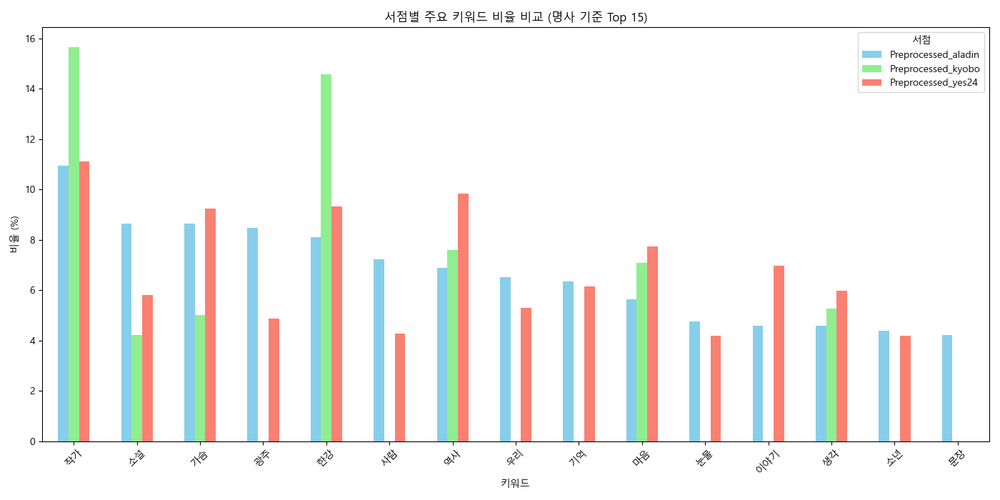

# YBIGTA 신입 8조 : 소설 '소년이 온다' 리뷰 분석 프로젝트

안녕하세요, 저희는 YBIGTA 교육세션 팀플과제팀 8조입니다!

## Git 과제
### 팀원 소개
팀원 소개는 다음과 같습니다.
#### 민세희
- 인적사항 : 인공지능학과 22학번 / 03년생 / DS -> DE 희망
- MBTI : ISTJ (F/T 반반)
- 관심사 : 야구 보기, 판타지 소설 읽기
- 희망진로 : 최대한 빠른 취업
#### 정다은
- 인적사항 : 문헌정보학과 25학번 대학원생, TSMM Lab / 00년생 / DS팀 희망
- MBTI : ENFJ
- 관심사 : 멀티모달
- 희망진로 : 금융 분야 AI 직군
#### 이주원
- 인적사항 : 응용통계학과 20학번 / 00년생 / DE 희망
- MBTI : ISFJ
- 관심사 : 스포츠 경기 보기(야구, 축구, F1 등), 음악 디깅
- 희망진로 : 데이터 엔지니어 or 야구단 데이터 분석가

### 사진 첨부
#### branch_protection.png

#### push_rejected.png

#### review_and_merged.png

### 코드 실행 방법
- `cd {YBIGTA_newbie_team_project 루트폴더}`로 경로 설정
- `pip install -r requirements.txt` 명령어를 통해 필요한 패키지 설치
#### web
- `pytest test/test_user_service.py` 실행
- `pytest test/test_user_router.py` 실행
- `mypy test/test_user_service.py` 실행
- `mypy test/test_user_router.py` 실행
#### 크롤링
- `python -m review_analysis.crawling.main -o database --all`로 크롤링 실행
#### EDA/FE
- `python -m review_analysis.preprocessing.main --output_dir database --all`로 전처리 진행

## 크롤링
### 데이터 소개
2024년 노벨문학상을 수상한 한강 작가의 소설 '소년이 온다'에 대한 주요 온라인 서점 3곳의 리뷰를 분석하고자 하였습니다.
#### 크롤링한 사이트의 링크
  - 교보문고(https://product.kyobobook.co.kr/detail/S000000610612)
  - YES24(https://www.yes24.com/product/goods/13137546)
  - 알라딘(https://www.aladin.co.kr/shop/wproduct.aspx?ItemId=40869703&start=slayer#K662930932_CommentReview)
#### 데이터 형식
  - 개별 크롤링 파일 실행으로 얻은 리뷰를 csv 파일로 저장(reviews_kyobo.csv, reviews_yes24.csv, reviews_aladin.csv)
#### 데이터 개수
  - reviews_kyobo.csv : 2838개
  - reviews_yes24.csv : 1968개
  - reviews_aladin.csv : 634개

## EDA
### 교보문고

- 대부분의 별점이 4점으로 몰려있는 모습(만점 4점)
- 1~3점은 매우 드뭄 -> 사용자들이 대체로 긍정적인 평가만 남긴 경향
- 별점 범위를 벗어난 값은 없음 (1~4점 이외의 값은 빨간색으로 나타나도록 설정한 코드를 바탕으로, 해당 그래프에서는 벗어난 값 X)
- 50자 이하의 짧은 리뷰가 대부분 / 긴 리뷰는 드물지만 2000자 이상까지 존재(이상치로 확인 가능)
- 리뷰 대부분이 2024 ~ 2025년에 집중
- 너무 먼 과거나 미래의 데이터 이상치가 존재하지 않음
### YES24

- 5점 리뷰가 절대다수, 4점 이하의 리뷰는 거의 없음 -> 1~4점을 이상치로 탐지 가능 + 별점 범위를 벗어난 값은 없음 
- 리뷰의 길이는 전반적으로 매우 짧음 (0~50자) -> 한줄평 수집으로 인한 결과
- 2016~2023 사이에도 적은 수의 리뷰가 존재하나 2024년 이후 급증
- 너무 먼 과거나 미래의 데이터 이상치가 존재하지 않음
### 알라딘

- 5점 리뷰의 비율이 압도적이며, 4점도 일부 존재 -> 1~3점을 이상치로 탐지 가능 + 별점 범위를 벗어난 값은 없음 
- 1~3점 리뷰는 희귀해 다른 온라인 서점과 마찬가지로 호평 위주 
- 리뷰 길이는 분포가 다양하지만 대부분 100자 내외
- 400자 이상의 매우 긴 리뷰가 존재하며, 이상치로 분류됨
- 출간일 근처인 2014~2016 사이에 리뷰가 상대적으로 많이 존재
- 이후 점점 감소하다가 2024년부터 급증
- 너무 먼 과거나 미래의 데이터 이상치가 존재하지 않음

공통적으로 `한강 작가가 2024년 10월 10일 노벨문학상을 수상한 이후`, 세 서점 모두에서 리뷰 수가 급격히 증가하는 양상을 보였습니다.
이에 따라 `리뷰 키워드 분석과 시계열 분석`을 통해, 해당 작품에 대한 관심 급증 시점과 독자 반응 변화를 정량적으로 분석하기로 했습니다.

## 전처리 / FE
각 크롤링 사이트(YES24, 교보문고, 알라딘)의 리뷰 데이터에 대해 동일한 전처리 및 특징 추출 과정을 거쳤습니다. 아래는 YES24 데이터를 예시로 설명한 전처리 및 피처 엔지니어링 절차입니다.

### 1. 데이터 불러오기 및 결측치, 이상치 처리
- `rating`, `review`, `date` 컬럼에서 결측치 제거
- `rating`은 1~5점 사이의 유효값만 필터링(이상치 제거)
- `date` 컬럼은 `datetime` 포맷으로 변환 및 파싱 오류 제거

### 2. 텍스트 전처리
- 리뷰 내용(`review`)에서 특수문자 제거:
  - 한글, 영문, 숫자, 공백을 제외한 모든 문자 제거
- 불용어(Stopwords) 제거 및 형태소 분석:
  - `Okt` 형태소 분석기를 사용해 형태소 단위로 토큰화
  - 조사, 접속사, 감탄사, 자주 등장하지만 의미 없는 단어들 제거
  - 불용어 예시: `이`, `그`, `저`, `ㅋㅋ`, `ㅠㅠ`, `입니다`, `그리고`, `하지만` 등
- 토큰을 다시 공백 기준으로 병합하여 `clean_review` 생성
- 너무 짧거나 긴 리뷰 제거 (10자 미만, 100자 초과)

### 3. 파생변수 생성
- `year_month`: 날짜(`date`) 컬럼에서 연-월(`YYYY-MM`) 파생

### 4. 텍스트 벡터화 (TF-IDF)
- `clean_review` 컬럼에 대해 `TfidfVectorizer`를 적용하여 벡터화 수행
- 최대 100개의 주요 토큰에 대해 TF-IDF 벡터 생성
- 출력된 `tfidf_matrix`는 이후 모델 학습 및 분석에 활용 가능

### 5. 저장
- 최종 전처리된 데이터는 다음 컬럼으로 구성되어 저장됨:
  - `review`, `clean_review`, `rating`, `date`, `year_month`
- 저장 경로 예시: `preprocessed_reviews_yes24.csv`

## 비교분석

### 주요 키워드 분석

각 서점별 리뷰 데이터를 전처리하고 TF-IDF 기반으로 벡터화한 결과의 빈도 상위 키워드들을 분석하였습니다.

#### 교보문고

- 상위 키워드: `작가`, `한강`, `역사`, `구매`, `마음`, `작품`, `생각`
- **작가와 작품 자체에 대한 언급**이 많았고, `역사`, `노벨문학상`, `광주`와 같은 **사회적·정치적 키워드**도 등장
- 독자들이 책의 **내용성과 작가 정체성에 초점을 두는 경향**

#### 알라딘

- 상위 키워드: `작가`, `가슴`, `소설`, `광주`, `한강`, `사람`, `기억`
- `광주`, `역사`, `기억`, `고통`, `아픔` 등의 키워드가 다수 등장
- 감정적 반응과 **사건 기반의 정서적 키워드**가 강하게 나타남
- **한강 작가**와 작품 배경인 **광주민주화운동** 관련 키워드가 집중적으로 언급됨

#### YES24

- 상위 키워드: `작가`, `역사`, `한강`, `가슴`, `마음`, `이야기`, `기억`
- 감성적 키워드(`가슴`, `마음`, `기억`)와 서사적 키워드(`이야기`, `역사`)가 혼재됨
- 독자들이 **감동적인 내용**이나 **작가의 의도**를 중심으로 리뷰를 남기는 경향

#### 교차 비교 요약 (Top 15 키워드 기준)

- `작가`, `한강`, `가슴`, `역사`, `마음`, `소설` 등은 세 서점 모두에서 공통적으로 상위권
- `광주`, `노벨문학상`은 교보문고와 알라딘에서 강조됨
- YES24는 `이야기`, `생각`, `추천`, `작품` 등의 **개인적 감상 중심 키워드**가 특징

### 시계열 분석: 연·월별 리뷰 비율

서점별로 전처리된 리뷰 데이터를 `year-month` 단위로 집계하여 리뷰 작성 시점의 흐름을 비교하였습니다.

#### 전체 트렌드

- **2024년부터 모든 서점에서 리뷰량이 급격히 증가**
- 이는 아마도 **한강 작가의 노벨문학상 수상**과 연관이 있을 가능성이 높음

#### 서점별 특징
- **알라딘**은 **2015년~2016년** 시기에 두 번의 리뷰 급증 현상 -> 초기 독자 반응이 강했던 것으로 해석 가능
- **YES24**와 **교보문고**는 2024년 이후 **비슷한 시기에 집중적 리뷰 생성** -> 후기 사용자들의 유입
- 알라딘은 과거부터의 리뷰 분포가 넓고 고르며, **장기적 이용자 기반**을 보유한 것으로 보임

#### 해석 요약
- YES24, 교보문고는 최근 관심 급증으로 인해 **신규 독자 유입 많음**
- 알라딘은 **이전부터 꾸준히 리뷰가 쌓여온 플랫폼**으로, **초기 팬층 기반의 반응**이 반영됨

### 결론
- 모든 플랫폼에서 '작가', '한강', '역사'는 핵심 키워드
- 감정 중심(알라딘), 정보 중심(교보), 감상 중심(YES24)의 리뷰 스타일 차이가 존재
- 2024년을 기점으로 한 리뷰량 급증은 한강 작가의 노벨문학상 수상과 관련된 흐름일 가능성이 높음
